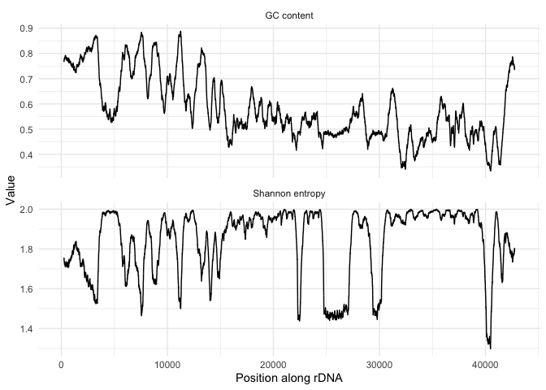

# rDNA_sequence_complexity

This is the Markdown output of the RMarkdown document `main.Rmd`. Since Markdown doesn't render LaTeX, formulas will not be displayed correctly. 

## R packages and data

We load necessary R packages.


```r
library(tidyverse)                 # Plotting and data reshaping
library(zoo)                       # For sliding windows using rollapply
library(seqinr)                    # For GC
```

Data for the human canonical rDNA repeat unit were downloaded from GenBank [Accession number U13369.1](https://www.ncbi.nlm.nih.gov/nuccore/555853) as a FASTA file.

We read in the FASTA file:


```r
seq <- read.fasta("U13369.1.fa")
```


## GC content

We calculate the GC content in overlapping sliding windows of length `d` along the full length of the rDNA.


```r
d <- 500
GC <- seq %>%
    getSequence() %>%
    magrittr::extract2(1) %>%
    zoo() %>%
    rollapply(width = d, FUN = GC, align = "center", fill = NA)
```

## Shannon entropy

Similarly to the GC content, we calculate the Shannon entropy
$$
H = -\sum_{i} f_i \log_2{f_i}
$$
in overlapping sliding windows of length `d` along the rDNA. Here $f_i$ denotes the frequency of nucleotide $i$ per window. $H$ is given in bits.


```r
d <- 500
ShannonH <- function(x, letters = c("A", "C", "G", "T")) {
    freq <- table(factor(toupper(x), letters)) / length(x)
    -sum(freq * log2(freq))
}
SE <- seq %>%
    getSequence() %>%
    magrittr::extract2(1) %>%
    zoo() %>%
    rollapply(width = d, FUN = ShannonH, align = "center", fill = NA)
```

## Plot

We show GC content and Shannon entropy along the rDNA


```r
list(fortify(GC), fortify(SE)) %>%
    reduce(left_join, by = "Index") %>%
    pivot_longer(-Index, names_to = "Metric", values_to = "Value") %>%
    mutate(
        Metric = if_else(
            Metric == "GC", "GC content", "Shannon entropy")) %>%
    ggplot(aes(Index, Value)) +
    geom_line() +
    facet_wrap(~ Metric, scales = "free_y", ncol = 1) +
    theme_minimal() +
    labs(x = "Position along rDNA")
```

```
## Warning: Removed 499 row(s) containing missing values (geom_path).
```

<!-- -->
